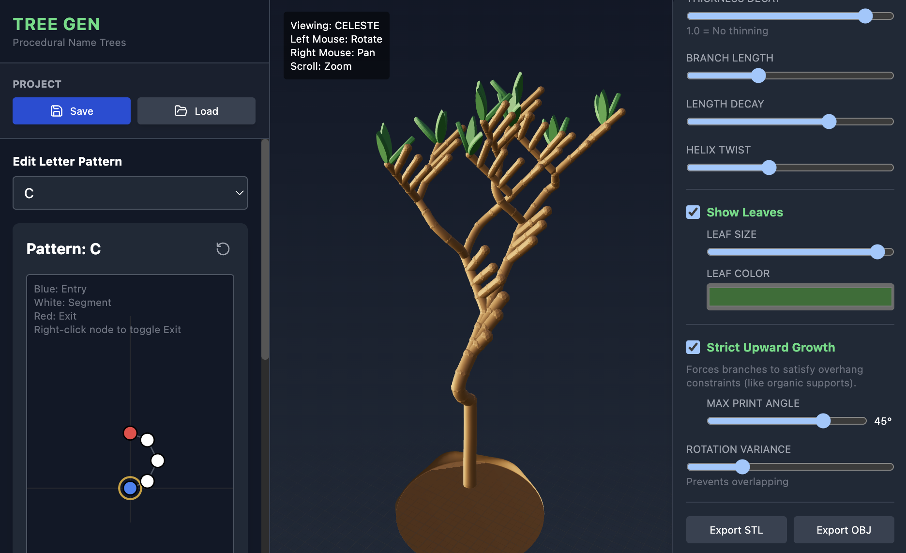

# Name Tree Generator

Grow names into organic, printable 3D trees. Type any word, sculpt each letter’s growth pattern, and watch a branching tree appear in 3D. Tweak realism, add leaves, and export the final result for 3D printing or digital art.

<p align="center">
  
</p>

Highlights:
- Editable letter “growth” patterns with draggable nodes and exits
- Real‑time 3D tree generation using React Three Fiber
- Organic vs. geometric styles, surface roughness, and spiral growth
- Printable mode with overhang constraints for easier 3D printing
- Export as STL or OBJ
- Save/load full projects (JSON) and share/import patterns (YAML)

---

## Demo Imagination

- Left: Pattern Editor — sculpt per‑letter branches (entry, segments, exits)
- Center: 3D View — orbit, pan, zoom; generate/export with one click
- Right: Controls — geometry style, sizes, decay, twist, leaves, printable constraints

Mouse controls:
- Left mouse drag: rotate
- Right mouse drag: pan
- Scroll: zoom

---

## Features

- Word-driven generation: each character maps to a reusable letter pattern
- Pattern editor:
- Blue node = entry (anchored)
- White nodes = segments (drag to reshape)
- Red nodes = exits (right-click to toggle)
- Add Segment / Add Exit / Delete Selected
- Configurable:
- Geometry style: organic or geometric
- Base mound/cylinder, trunk thickness and decay
- Branch length and decay
- Helix twist (golden-angle default)
- Roughness and rotation variance
- Printable mode with max overhang angle
- Leaves: size and color
- Import/Export:
- Export patterns as YAML, import YAML to merge
- Save full project as JSON (word, config, patterns), load later
- Export mesh as STL or OBJ

---

## Tech Stack

- React + Vite + TypeScript
- three.js, @react-three/fiber, @react-three/drei
- three-stdlib (STL/OBJ exporters, geometry utils)
- js-yaml for pattern import/export
- TailwindCSS for quick UI styling (via CDN)

---

## Prerequisites

- Node.js 18+ (recommended 18 or 20)
- npm, pnpm, or yarn

---

## Getting Started (Local)

1) Clone and install
```bash
git clone <your-repo-url> name-tree-generator
cd name-tree-generator
npm install
# or: pnpm install / yarn
```

2) Run the dev server
```bash
npm run dev
```
Open the printed URL (default http://localhost:3000).

3) Build for production
```bash
npm run build
```

4) Preview the production build locally
```bash
npm run preview
```

---

## How To Use

- Type a word or name (A–Z). Max 10 characters recommended.
- Click “GENERATE TREE” to update the 3D view.
- Edit letter patterns in the left panel:
- Use the dropdown to pick a letter.
- Drag nodes to reshape paths.
- Right‑click a node to toggle Exit (red). Exits are where the next letter grows.
- Add Segment extends from the selected node; Add Exit creates a branching tip.
- Delete Selected removes the current node (except the entry).
- Reset returns the pattern to its default template.
- Adjust appearance in the right panel:
- Geometry Style: organic or geometric
- Roughness: surface noise
- Root Height, Base Radius, Initial Thickness, Thickness Decay
- Branch Length, Length Decay, Helix Twist
- Leaves: toggle, size, color
- Printable mode: caps overhang angle; adds upward bias for branches and leaves
- Rotation Variance: helps avoid overlapping branches
- Export
- Export STL/OBJ from the right panel
- Save to JSON: full project (word, config, patterns)
- Load: JSON (project) or YAML (patterns only) from the left panel

Notes for 3D printing:
- Export units are arbitrary; scale in your slicer as needed.
- Printable mode reduces overhangs by forcing upward growth; not a guarantee, but a helpful starting point.

---

## File Formats

- Project (JSON): contains word, config, and all patterns. Example:
```json
{
"timestamp": 1736192100000,
"word": "CELESTE",
"config": { "...": "..." },
"patterns": { "A": { "...": "..." }, "B": { "...": "..." } }
}
```

- Patterns (YAML): map of letter patterns (merged on import). Example:
```yaml
C:
char: "C"
nodes:
   - { id: "node-0", x: 0, y: 0, isExit: false }
   - { id: "node-1", x: 0.5, y: 0.2, isExit: false }
   - { id: "node-2", x: 0.8, y: 0.8, isExit: false }
   - { id: "node-3", x: 0.5, y: 1.4, isExit: false }
   - { id: "node-4", x: 0, y: 1.6, isExit: true }
connections:
   - { from: "node-0", to: "node-1" }
   - { from: "node-1", to: "node-2" }
   - { from: "node-2", to: "node-3" }
   - { from: "node-3", to: "node-4" }
```

---

## Project Structure

- `App.tsx` — layout, state, import/export, wiring
- `components/`
- `TreeViewer.tsx` — 3D scene, orbit controls, exporters
- `Controls.tsx` — configuration UI and export buttons
- `PatternEditor.tsx` — letter pattern sculpting canvas
- `services/treeGenerator.ts` — builds the mesh from the word + patterns + config
- `constants.ts` — defaults and initial letter patterns
- `types.ts` — TypeScript interfaces
- `index.html`, `index.tsx`, `vite.config.ts`

---

## Tips and Gotchas

- Only A–Z characters are used; other characters are ignored.
- The entry node (blue) is fixed; grow from it by adding segments/exits.
- Printable mode:
- Enforces a max angle from vertical (default 45°) on branches/leaves.
- You can still get tricky overhangs with extreme patterns; adjust decay/length and try again.
- Large trees (many letters, high segment counts) can produce heavy meshes; exporting might take time.

---

## Troubleshooting

- Blank or very slow scene:
- Check your browser supports WebGL/Hardware acceleration.
- Reduce word length or roughness; switch to Geometric; reduce Branch Length.
- Export not triggering:
- Try clicking Export again; ensure the scene has generated (click “GENERATE TREE” first).
- Load not working:
- JSON must contain both config and patterns for projects.
- YAML must be valid maps keyed by letters (A–Z).

---

## License

Choose and add a license if you plan to distribute. MIT is a common, permissive option.

---

## Acknowledgements

- Built with three.js and React Three Fiber
- Exporters and utilities from three-stdlib
- Icons by lucide-react

Happy growing!